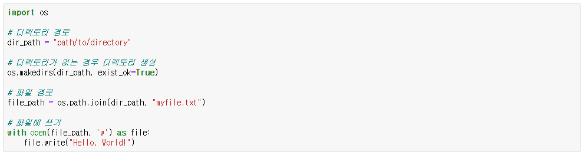
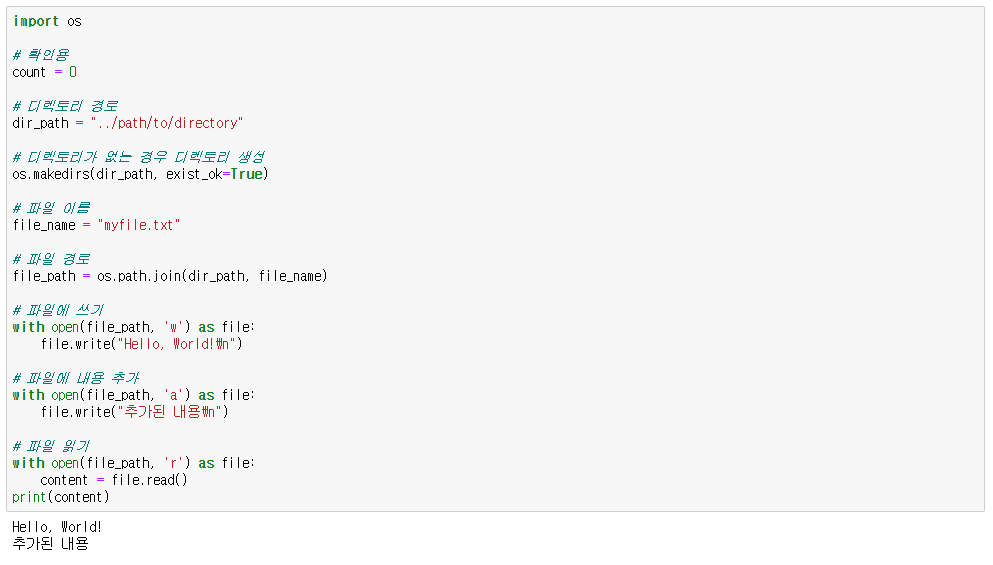

## File 쓰기
```
with open('myfile.txt', 'w') as file:
    file.write("Hello, World!")
```


```
with open('myfile.txt', 'a') as file:
    file.write("\nMore content.")
```

## File 읽기

```
with open('myfile.txt', 'r') as file:
    content = file.read()
print(content)
```


## 디렉터리 경로 작성

<p align="center">
  
</p>

```
import os

# 디렉토리 경로
dir_path = "path/to/directory"

# 디렉토리가 없는 경우 디렉토리 생성
os.makedirs(dir_path, exist_ok=True)

# 파일 경로
file_path = os.path.join(dir_path, "myfile.txt")

# 파일에 쓰기
with open(file_path, 'w') as file:
    file.write("Hello, World!")
```

---

## **___예제___**

<p align="center">
  
</p>

```
import os

# 확인용
count = 0

# 디렉토리 경로
dir_path = "../path/to/directory"

# 디렉토리가 없는 경우 디렉토리 생성
os.makedirs(dir_path, exist_ok=True)

# 파일 이름
file_name = "myfile.txt"

# 파일 경로
file_path = os.path.join(dir_path, file_name)

# 파일에 쓰기
with open(file_path, 'w') as file:
    file.write("Hello, World!\n")

# 파일에 내용 추가
with open(file_path, 'a') as file:
    file.write("추가된 내용\n")

# 파일 읽기
with open(file_path, 'r') as file:
    content = file.read()
print(content)

> Hello, World!
> 추가된 내용
```

```
# 파일에 내용 추가
with open(file_path, 'a') as file:
    file.write("추가된 내용" + str(count) + "\n")

count += 1
```

```
# 파일 읽기
with open(file_path, 'r') as file:
    content = file.read()
print(content)
```


---

<!--목차 & 다음으로 페이지 이동-->
[목차](https://github.com/Devcurve/Python/blob/main/README.md)<br>
[이전 페이지](https://github.com/Devcurve/Python/blob/main/Chapter_2/Function.md)<br>
[다음 페이지](https://github.com/Devcurve/Python/blob/main/Chapter_2/class.md)
