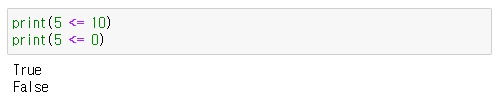

## 연산자 (Operators)

### ___산술 연산자 (Arithmetic Operators)___

- `+`: 덧셈 연산을 수행.
```
print( 10 + 20 )
> 30
```

- `-`: 뺄셈 연산을 수행.
```
print( 30 - 20 )
> 10
```

- `*`: 곱셈 연산을 수행.
```
print( 10 * 3 )
> 30
```

- `/`: 나눗셈 연산을 수행. (실수 결과 반환)
```
print( 10 / 5 )
> 2
```

- `//`: 나눗셈 연산을 수행. (정수 결과 반환, 소수점 이하의 값은 소실 됨)
```
print( 10 // 3 )
> 3
```

- `%`: 나머지 연산을 수행 후 나머지 값을 반환.
```
print( 10 % 3 )
> 1
```

- `**`: 거듭제곱 연산을 수행.
```
print( 10 ** 3 ) # 10을 3번 곱함  예: 10 * 10 * 10
> 1000
```

---
### ___대입 연산자___
- `=`: 우측의 값을 좌측에 있는 변수로 할당.
```
n = 0
print(n)
> 0
```

- `+=`: 우측의 값을 좌측 변수에 더하면서 할당.
```
n = 0
n += 10
print(n)
> 10
```

- `-=`: 우측의 값을 좌측 변수에서 빼면서 할당.
```
n = 10
n -= 10
print(n)
> 0
```

- `*=`: 우측의 값을 좌측 변수에 곱하면서 할당.
```
n = 2
n *= 10
print(n)
> 20
```

- `/=`: 우측의 값을 좌측 변수로 나누면서 할당. (실수 결과 반환)
```
n = 10
n /= 5
print(n)
> 2.0
```

- `//=`: 우측의 값을 좌측 변수로 나누면서 할당. (정수 결과 반환)
```
n = 10
n //= 5
print(n)
> 3
```

- `%=`: 우측의 값을 좌측 변수로 나눈 나머지를 할당
```
n = 10
n %= 3
print(n)
> 1
```

- `**=`: 우측의 값을 좌측 변수에 거듭제곱의 값을 할당.
```
n = 10
n **= 3
print(n)
> 1000
```

---
### ___비교 연산자___
- `==`: 좌우 항이 동일한지 비교.
```
print(10 == 10)
print(10 == 5)
> True
> False
```
<p align="center">
  
</p><br><br>


- `!=`: 좌우 항이 다른지 비교.
```
print(10 != 10)
print(10 != 5)
> False
> True
```
<p align="center">
  
</p><br><br>


- `>`: 좌항이 우항보다 큰지 비교.
```
print(5 > 10)
print(5 > 0)
> False
> True
```
<p align="center">
  
</p><br><br>


- `<`: 좌항이 우항보다 작은지 비교.
```
print(5 < 10)
print(5 < 0)
> True
> False
```
<p align="center">
  
</p><br><br>


- `>=`: 좌항이 우항보다 크거나 같은지 비교.
```
print(5 >= 10)
print(5 >= 0)
> False
> True
```
<p align="center">
  
</p><br><br>


- `<=`: 좌항이 우항보다 작거나 같은지 비교.
```
print(5 <= 10)
print(5 <= 0)
> True
> False
```
<p align="center">
  
</p><br><br>

---
### ___논리 연산자___

- `and`: 좌우 조건식이 모두 참인지 확인.
```
print(True and True)
print(False and True)
print(True and False)
print(False and False)
```


<p align="center">
  
</p><br><br>


- `or`: 좌우 조건식 중 하나 이상이 참인지 확인.
```
print(True or True)
print(False or True)
print(True or False)
print(False or False)
```

<p align="center">
  
</p><br><br>


- `not`: 조건식의 결과를 반대로 반환.
```
print(not True)
print(not False)
```

<p align="center">
  
</p><br><br>

---
### ___비트연산자___

- `&`: 비트 단위로 AND 연산을 수행.

```
num1 = 10  # 1010
num2 = 7   # 0111

result = num1 & num2  # 0010

print(result)  

> 2
```
<br><br>

- `|`: 비트 단위로 OR 연산을 수행.

```
num1 = 10  # 1010
num2 = 7   # 0111

result = num1 | num2  # 1111

print(result)

> 15
```
<br><br>

- `^`: 비트 단위로 XOR 연산을 수행.

```
num1 = 10  # 1010
num2 = 7   # 0111

result = num1 ^ num2  # 1101

print(result)  

> 13
```
<br><br>

- `~`: 비트 단위로 NOT 연산을 수행.

```
num = 10   # 1010

result = ~num  # -11

pint(result)  

> -11
```
<br><br>

- `<<`: 비트를 왼쪽으로 이동시킴.

```
num = 5    # 0101

result = num << 2  # 010100

print(result)  

> 20
```
<br><br>

- `>>`: 비트를 오른쪽으로 이동시킴.

```
num = 20   # 010100

result = num >> 2  # 0101

print(result)

> 5
```

---

### ___추가___

is: 두 개의 객체가 동일한 객체인지 확인.

```
x = 10
y = 10

if x is y:
    print("x와 y는 동일한 객체입니다.")
else:
    print("x와 y는 다른 객체입니다.")
```
<br><br>

is not: 두 개의 객체가 다른 객체인지 확인.

```
x = 10
y = 20

if x is not y:
    print("x와 y는 다른 객체입니다.")
else:
    print("x와 y는 동일한 객체입니다.")
```
<br><br>


in: 특정 요소가 시퀀스(리스트, 튜플, 문자열 등)에 속하는지 확인.

```
fruits = ["사과", "바나나", "딸기", "수박"]

if "딸기" in fruits:
    print("딸기는 과일 목록에 포함되어 있습니다.")
else:
    print("딸기는 과일 목록에 포함되어 있지 않습니다.")
```
<br><br>


not in: 특정 요소가 시퀀스에 속하지 않는지 확인.

```
fruits = ["사과", "바나나", "딸기", "수박"]

if "오렌지" not in fruits:
    print("오렌지는 과일 목록에 포함되어 있지 않습니다.")
else:
    print("오렌지는 과일 목록에 포함되어 있습니다.")
```
---
<!--목차 & 다음으로 페이지 이동-->
[목차](https://github.com/Devcurve/Python/blob/main/README.md)<br>
[이전 페이지](https://github.com/Devcurve/Python/blob/main/Chapter_2/loopFor.md)<br>
[다음 페이지](https://github.com/Devcurve/Python/blob/main/Chapter_2/loopWhile.md)
