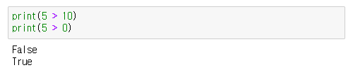
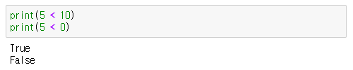

## 연산자 (Operators)

### ___산술 연산자 (Arithmetic Operators)___

- `+`: 덧셈 연산을 수행.
```
print( 10 + 20 )
> 30
```

- `-`: 뺄셈 연산을 수행.
```
print( 30 - 20 )
> 10
```

- `*`: 곱셈 연산을 수행.
```
print( 10 * 3 )
> 30
```

- `/`: 나눗셈 연산을 수행. (실수 결과 반환)
```
print( 10 / 5 )
> 2
```

- `//`: 나눗셈 연산을 수행. (정수 결과 반환, 소수점 이하의 값은 소실 됨)
```
print( 10 // 3 )
> 3
```

- `%`: 나머지 연산을 수행 후 나머지 값을 반환.
```
print( 10 % 3 )
> 1
```

- `**`: 거듭제곱 연산을 수행.
```
print( 10 ** 3 ) # 10을 3번 곱함  예: 10 * 10 * 10
> 1000
```

---
### ___대입 연산자___
- `=`: 우측의 값을 좌측에 있는 변수로 할당.
```
n = 0
print(n)
> 0
```

- `+=`: 우측의 값을 좌측 변수에 더하면서 할당.
```
n = 0
n += 10
print(n)
> 10
```

- `-=`: 우측의 값을 좌측 변수에서 빼면서 할당.
```
n = 10
n -= 10
print(n)
> 0
```

- `*=`: 우측의 값을 좌측 변수에 곱하면서 할당.
```
n = 2
n *= 10
print(n)
> 20
```

- `/=`: 우측의 값을 좌측 변수로 나누면서 할당. (실수 결과 반환)
```
n = 10
n /= 5
print(n)
> 2.0
```

- `//=`: 우측의 값을 좌측 변수로 나누면서 할당. (정수 결과 반환)
```
n = 10
n //= 5
print(n)
> 3
```

- `%=`: 우측의 값을 좌측 변수로 나눈 나머지를 할당
```
n = 10
n %= 3
print(n)
> 1
```

- `**=`: 우측의 값을 좌측 변수에 거듭제곱하고, 그 결과를 좌측 변수에 할당합니다.
```
n = 10
n **= 3
print(n)
> 1000
```

---
### ___비교 연산자___
- ==: 좌우 항이 동일한지 비교.
```
print(10 == 10)
print(10 == 5)
> True
> False
```
<p align="center">
  
</p><br><br>


- !=: 좌우 항이 다른지 비교합니다.
```
print(10 != 10)
print(10 != 5)
> False
> True
```
<p align="center">
  
</p><br><br>


- >: 좌항이 우항보다 큰지 비교합니다.
```
print(5 > 10)
print(5 > 0)
> False
> True
```
<p align="center">
  
</p><br><br>


- <: 좌항이 우항보다 작은지 비교합니다.
```
print(5 < 10)
print(5 < 0)
> True
> False
```
<p align="center">
  
</p><br><br>


- >=: 좌항이 우항보다 크거나 같은지 비교합니다.
```
print(10 >= 10)
print(10 >= 5)
> False
> True
```
<p align="center">
  
</p><br><br>


- <=: 좌항이 우항보다 작거나 같은지 비교합니다.
```
print(10 <= 10)
print(10 <= 5)
> True
> False
```
<p align="center">
  
</p><br><br>

---
