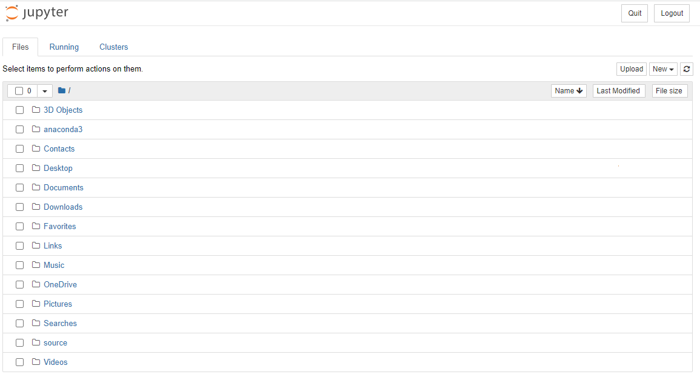
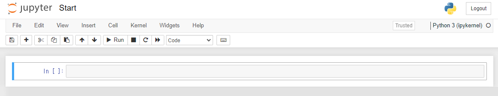
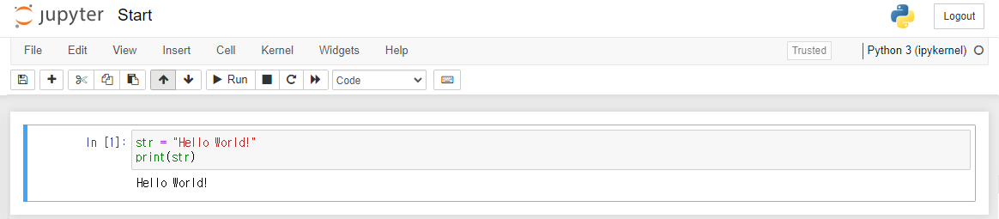

## **Python 시작**

<p align="center">
  
</p>

- 처음 시작하면 이런 화면이 나온다. 먼저 github에서 clone해둔 repository의 경로와 맞춰주고 진행 하겠습니다. <br>예 `Documents -> GitHub -> Python`<br>예 `c:/user/Documents/GitHub/Python`

---

<p align="center">
  
</p>
- 이렇게 생긴 창이 하나 나옵니다.<br>이제부터 본격적으로 python을 시작4 수 있는 모든 준비가 끝났다4 보시면 됩니다. <br><br>

```
str = "Hello World!"
print(str)
```
- 이렇게 작성해 한 후에
<p align="center">
  
</p>를 입력 합니다.<br><br>


- 그럼 다음과 같은 결과를 확인할 수 있습니다.

<p align="center">
  
</p>

- 이렇게 Python을 활용한 문자열 출력을 해봤습니다.

---

## **Jupyter notebook 단축키**
- **셀 실행후 아래 셀 추가**: `Shift + Enter`, `Alt + Enter`

- **셀 아래에 셀 추가**: `B`
- **셀 위에 셀 추가**: `A`

- **셀 삭제 & 잘라내기**: `X`
- **셀 복사**: `C`
- **셀 붙여넣기**: `V`

- **셀 합치기**: `Shift + M`

[목차](https://github.com/Devcurve/Python/blob/main/README.md)<br>
[이전 페이지](https://github.com/Devcurve/Python/blob/main/Chapter_2/Advantages.md)<br>
[다음 페이지](https://github.com/Devcurve/Python/blob/main/Chapter_2/Variable.md)
