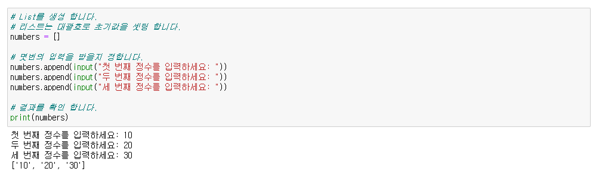
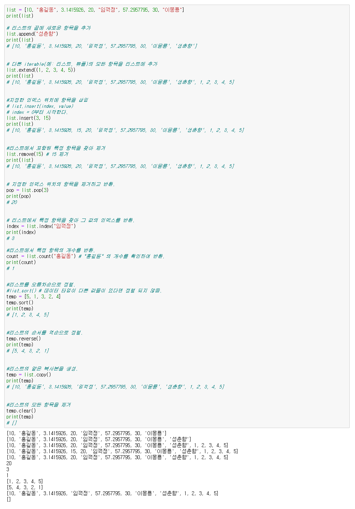
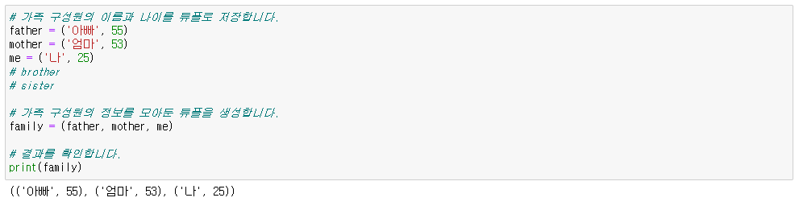
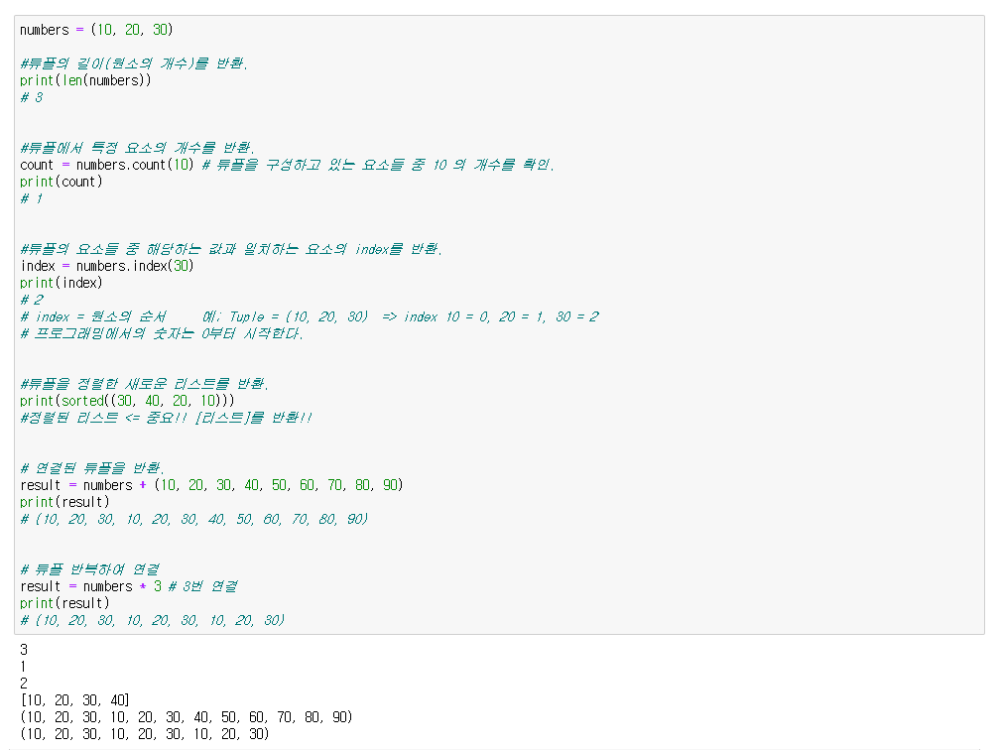
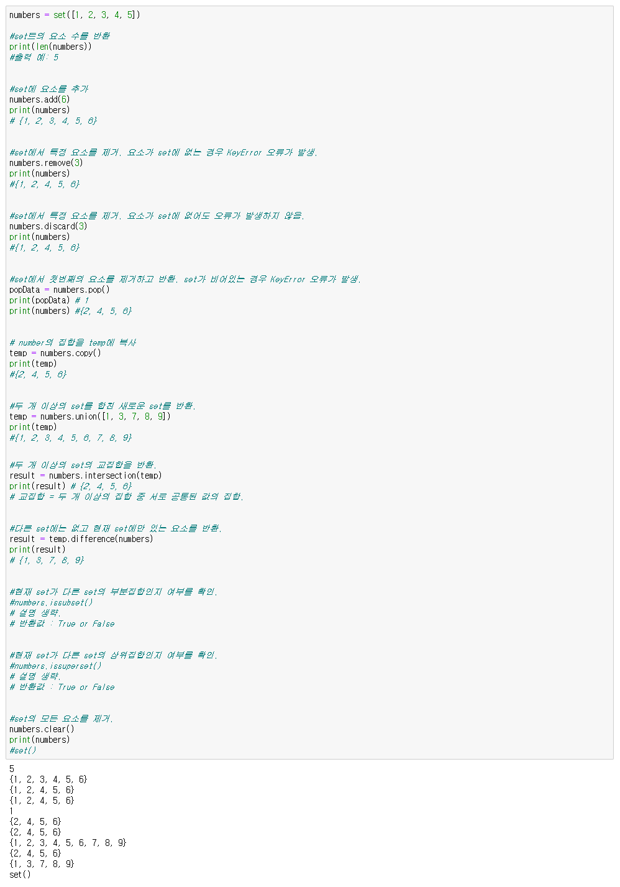
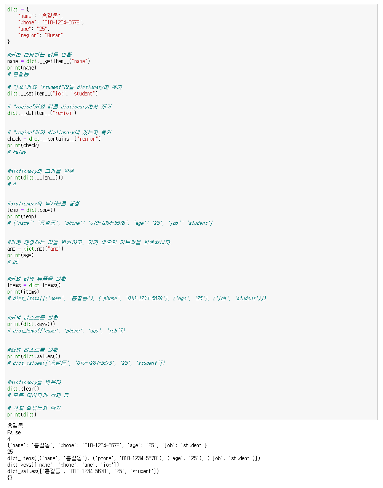

#### Python에서 사용되는 자료형(Data Types)


1. **String**
> - 문자열 (`str`): 문자들의 연속을 나타내는 자료형입니다. 예: `"Hello, World!"`, `'Python'`

```
name = input("이름을 입력하세요: ")
greeting = "안녕하세요, 저는 " + name + " 입니다. "
print(greeting)

> Shift + Enter
```
---


2. **Number**
>- 정수형 (`int`): 정수를 나타내는 자료형입니다. 예: `10`, `-5`
>- 실수형 (`float`): 실수를 나타내는 자료형입니다. 예: `3.14`, `-2.5`

```
> 예제 1
# 두 정수의 합 구하기

# 두 개의 정수를 변수에 저장합니다.
num1 = 5
num2 = 3

# 두 정수를 더하여 결과를 저장하는 변수를 만듭니다.
sum_result = num1 + num2

# 결과를 출력합니다.
print("두 정수의 합:", sum_result)
```

```
> 예제 2
# 두 정수를 입력받고 합 구하기

# 두 개의 정수를 입력받아 변수에 저장합니다.
num1 = int(input("첫 번째 정수를 입력하세요: "))
num2 = int(input("두 번째 정수를 입력하세요: "))

# 두 정수를 더하여 결과를 저장하는 변수를 만듭니다.
sum_result = num1 + num2

# 결과를 출력합니다.
print("두 정수의 합은:", sum_result)
```
---

3. **Boolean**
> - 불린 (`bool`): 참(True) 또는 거짓(False)을 나타내는 자료형입니다. 예: `True`, `False`

```
> 예제 1

result = True
print(result)

result = False
print(result)
```

```
> 예제 2

# 두 개의 정수를 입력받아 변수에 저장합니다.
num1 = int(input("첫 번째 정수를 입력하세요: "))
num2 = int(input("두 번째 정수를 입력하세요: "))

# 서로의 값을 비교하여 True & False 를 반환 합니다.
print(num1 < num2)
```

---

4. **List**
> - 리스트 (`list`): 여러 개의 값을 순서대로 담는 자료형입니다. 값들은 대괄호(`[]`)로 둘러싸여 있고, 쉼표로 구분됩니다. 예: `[1, 2, 3]`, `['apple', 'banana', 'orange']`

```
> 예제 1

# List를 생성 합니다.
# 리스트는 대괄호로 초기값을 셋팅 합니다.
numbers = []

# 몃번의 입력을 받을지 정합니다.
numbers.append(input("첫 번째 정수를 입력하세요: "))
numbers.append(input("두 번째 정수를 입력하세요: "))
numbers.append(input("세 번째 정수를 입력하세요: "))

# 결과를 확인 합니다.  
print(numbers)
```
<p align="center">
  
</p>
<br><br>

```
list = [10, "홍길동", 3.1415926, 20, "임꺽정", 57.2957795, 30, "이몽룡"]
print(list)

# 리스트의 끝에 새로운 항목을 추가
list.append("성춘향")
print(list)
# [10, '홍길동', 3.1415926, 20, '임꺽정', 57.2957795, 30, '이몽룡', '성춘향']


# 다른 iterable(예: 리스트, 튜플)의 모든 항목을 리스트에 추가
list.extend((1, 2, 3, 4, 5))
print(list)
# [10, '홍길동', 3.1415926, 20, '임꺽정', 57.2957795, 30, '이몽룡', '성춘향', 1, 2, 3, 4, 5]


#지정한 인덱스 위치에 항목을 삽입
# list.insert(index, value)
# index = 0부터 시작한다.
list.insert(3, 15)
print(list)
# [10, '홍길동', 3.1415926, 15, 20, '임꺽정', 57.2957795, 30, '이몽룡', '성춘향', 1, 2, 3, 4, 5]


#리스트에서 포함된 특정 항목을 찾아 제거
list.remove(15) # 15 제거
print(list)
# [10, '홍길동', 3.1415926, 20, '임꺽정', 57.2957795, 30, '이몽룡', '성춘향', 1, 2, 3, 4, 5]


# 지정한 인덱스 위치의 항목을 제거하고 반환.
pop = list.pop(3)
print(pop)
# 20


# 리스트에서 특정 항목을 찾아 그 값의 인덱스를 반환.
index = list.index("임꺽정")
print(index)
# 3

#리스트에서 특정 항목의 개수를 반환.
count = list.count("홍길동") # "홍길동" 의 개수를 확인하여 반환.
print(count)
# 1


#리스트를 오름차순으로 정렬.
#list.sort() # 데이터 타입이 다른 값들이 있다면 정렬 되지 않음.
temp = [5, 1, 3, 2, 4]
temp.sort()
print(temp)
# [1, 2, 3, 4, 5]


#리스트의 순서를 역순으로 정렬.
temp.reverse()
print(temp)
# [5, 4, 3, 2, 1]


#리스트의 얕은 복사본을 생성.
temp = list.copy()
print(temp)
# [10, '홍길동', 3.1415926, '임꺽정', 57.2957795, 30, '이몽룡', '성춘향', 1, 2, 3, 4, 5]


#리스트의 모든 항목을 제거
temp.clear()
print(temp)
# []
```
<p align="center">
  
</p>

---

5. **Tuple**
> - 튜플 (`tuple`): 여러 개의 값을 순서대로 담는 자료형입니다. 값들은 소괄호(`()`)로 둘러싸여 있고, 쉼표로 구분됩니다. 튜플은 변경할 수 없는(immutable) 자료형입니다. 예: `(1, 2, 3)`, `('red', 'green', 'blue')`

```
# 가족 구성원의 이름과 나이를 튜플로 저장합니다.
father = ('아빠', 55)
mother = ('엄마', 53)
me = ('나', 25)
# brother
# sister

# 가족 구성원의 정보를 모아둔 튜플을 생성합니다.
family = (father, mother, me)

# 결과를 확인합니다.
print(family)
```
<p align="center">
  
</p>
<br><br>

```
numbers = (10, 20, 30)

#튜플의 길이(원소의 개수)를 반환.
print(len(numbers))
# 3


#튜플에서 특정 요소의 개수를 반환.
count = numbers.count(10) # 튜플을 구성하고 있는 요소들 중 10 의 개수를 확인.
print(count)
# 1


#튜플의 요소들 중 해당하는 값과 일치하는 요소의 index를 반환.
index = numbers.index(30)
print(index)
# 2
# index = 원소의 순서     예; Tuple = (10, 20, 30)  => index 10 = 0, 20 = 1, 30 = 2
# 프로그래밍에서의 숫자는 0부터 시작한다.


#튜플을 정렬한 새로운 리스트를 반환.
print(sorted((30, 40, 20, 10)))
#정렬된 리스트 <= 중요!! [리스트]를 반환!!


# 연결된 튜플을 반환.
result = numbers + (10, 20, 30, 40, 50, 60, 70, 80, 90)
print(result)
# (10, 20, 30, 10, 20, 30, 40, 50, 60, 70, 80, 90)


# 튜플 반복하여 연결
result = numbers * 3 # 3번 연결
print(result)
# (10, 20, 30, 10, 20, 30, 10, 20, 30)
```
<p align="center">
  
</p>


---

6. **Set**
> - 집합 (`set`): 중복되지 않는 값을 담는 자료형입니다. 값들은 중괄호(`{}`)로 둘러싸여 있고, 쉼표로 구분됩니다. 예: `{1, 2, 3}`, `{'apple', 'banana', 'orange'}`

```
numbers = set([1, 2, 3, 4, 5])

#set트의 요소 수를 반환
print(len(numbers))
#출력 예: 5


#set에 요소를 추가
numbers.add(6)
print(numbers)
# {1, 2, 3, 4, 5, 6}


#set에서 특정 요소를 제거. 요소가 set에 없는 경우 KeyError 오류가 발생.
numbers.remove(3)
print(numbers)
#{1, 2, 4, 5, 6}


#set에서 특정 요소를 제거. 요소가 set에 없어도 오류가 발생하지 않음.
numbers.discard(3)
print(numbers)
#{1, 2, 4, 5, 6}


#set에서 첫번째의 요소를 제거하고 반환. set가 비어있는 경우 KeyError 오류가 발생.
popData = numbers.pop()
print(popData) # 1
print(numbers) #{2, 4, 5, 6}


# number의 집합을 temp에 복사
temp = numbers.copy()
print(temp)
#{2, 4, 5, 6}


#두 개 이상의 set를 합친 새로운 set를 반환.
temp = numbers.union([1, 3, 7, 8, 9])
print(temp)
#{1, 2, 3, 4, 5, 6, 7, 8, 9}


#두 개 이상의 set의 교집합을 반환.
result = numbers.intersection(temp)
print(result) # {2, 4, 5, 6}
# 교집합 = 두 개 이상의 집합 중 서로 공통된 값의 집합.


#다른 set에는 없고 현재 set에만 있는 요소를 반환.
result = temp.difference(numbers)
print(result)
# {1, 3, 7, 8, 9}


#현재 set가 다른 set의 부분집합인지 여부를 확인.
#numbers.issubset()
# 설명 생략.
# 반환값 : True or False


#현재 set가 다른 set의 상위집합인지 여부를 확인.
#numbers.issuperset()
# 설명 생략.
# 반환값 : True or False


#set의 모든 요소를 제거.
numbers.clear()
print(numbers)
#set()
```
<p align="center">
  
</p>

---

7. **Dictionary**
> - 사전 (`dict`): 키(key)와 값(value)의 쌍을 담는 자료형입니다. 키와 값은 콜론(`:`)으로 연결되고, 각 쌍들은 쉼표로 구분됩니다. 예: `{'name': 'John', 'age': 30, 'city': 'Seoul'}`

```
dict = {
    "name": "홍길동",
    "phone": "010-1234-5678",
    "age": "25",
    "region": "Busan"
}

#키에 해당하는 값을 반환
name = dict.__getitem__("name")
print(name)
# 홍길동

# "job"키와 "student"값을 dictionary에 추가
dict.__setitem__("job", "student")

# "region"키와 값을 dictionary에서 제거
dict.__delitem__("region")


# "region"키가 dictionary에 있는지 확인
check = dict.__contains__("region")
print(check)
# False


#dictionary의 크기를 반환
print(dict.__len__())
# 4


#dictionary의 복사본을 생성
temp = dict.copy()
print(temp)
# {'name': '홍길동', 'phone': '010-1234-5678', 'age': '25', 'job': 'student'}


#키에 해당하는 값을 반환하고, 키가 없으면 기본값을 반환합니다.
age = dict.get("age")
print(age)
# 25

#키와 값의 튜플을 반환
items = dict.items()
print(items)
# dict_items([('name', '홍길동'), ('phone', '010-1234-5678'), ('age', '25'), ('job', 'student')])


#키의 리스트를 반환
print(dict.keys())
# dict_keys(['name', 'phone', 'age', 'job'])


#값의 리스트를 반환
print(dict.values())
# dict_values(['홍길동', '010-1234-5678', '25', 'student'])


#dictionary를 비운다.
dict.clear()
# 모든 데이터가 삭제 됨

# 삭제 되었는지 확인.
print(dict)
```

##### - `dict = {}` 이런 형태로 초기화도 가능.

<p align="center">
  
</p>


<!--목차 & 다음으로 페이지 이동-->
[목차](https://github.com/Devcurve/Python/blob/main/README.md)<br>
[이전 페이지](https://github.com/Devcurve/Python/blob/main/Chapter_2/Variable.md)<br>
[다음 페이지](https://github.com/Devcurve/Python/blob/main/Chapter_2/if_else.md)
