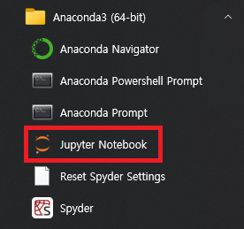

## Python install
###  - `python 3.7.2` [download](https://www.python.org/ftp/python/3.7.2/python-3.7.2-amd64.exe)<br>


<!-- 이미지 가운데 정렬 -->
<p align="center">
  <br><br>
  <br><br>
  <br><br>
  <br><br>
  <br><br>
  </p>
  <div class="centered-image">
    
  </div>

---

## ANACONDA install
### - `ANACONDA` [download](https://www.anaconda.com/download)
<p align="center">
  <br><br>
  <br><br>
  <br><br>
  <br><br>
  <br><br>
</p>

## jupyter notebook install

### `실행 방법`

##### - 시작 -> Anaconda3 -> jupyter notebook 실행

<p align="center">
  
</p>

### - 실행 하면 어떤 형식으로 실행을 시켜야 할지 물어보는 창이 나옵니다.<br>이때, 반드시 `크롬`을 선택해 주세요~!!


<!--
---

### - `방법2`

<p align="center">
  <br><br>
  
</p>
<br>

#### `C 드라이브로 이동`
<p align="center">
  
</p>

`````
cd\
`````
<br>

#### `사용할 폴더 생성`
<p align="center">
  
</p>

`````
md (사용할 폴더 이름)
`````
<br>

#### `생성된 폴더로 이동`
<p align="center">
  
</p>

`````
cd (생성된 폴더 이름)
`````
<br>

#### `jupyter notebook 설치`
<p align="center">
  
</p>

`````
pip install jupyter notebook
`````
<br>

#### `jupyter notebook 실행`
<p align="center">
  
</p>

`````
jupyter notebook
`````

- 두 가지 방법 중 아무거나 선택해서 설치.
-->

---

___교재___

###### - 현재 자료는 아래 교재를 권장하고 있습니다.
<br>

<!-- 이미지 가운데 정렬 -->
<p align="center">
  
</p>


___목차___
## Chapter 2. Python 입문
#### Data Type
<div id="DataType">
<!-- 특정 위치에 해당하는 내용 -->
</div>

<!-- - [데이터타입의 종류](./Chapter_2/ .md)
- [변수](./Chapter_2/ .md) -->

- [Python의 장.단점](./Learning/Advantages.md)
- [Hello World !](./Learning/Start.md)
- [변수](./Learning/Variable.md)
- [자료형](./Learning/dataType.md)
- [조건문](./Learning/if_else.md)
- [문법 기본(들여쓰기)](./Learning/space.md)
- [반복문(for)](./Learning/loopFor.md)
- [연산자](./Learning/Operators.md)
- [반복문(while)](./Learning/loopWhile.md)
- [함수](./Learning/Function.md)
- [클래스](./Learning/class.md)
- [파일 입출력](./Learning/class.md)

___실습예제 (코랩을 활용한 로또프로그램 작성)___
###### `구글 코랩으로 작성된 실습 예제는 이곳에서 제공되지 않습니다.`
