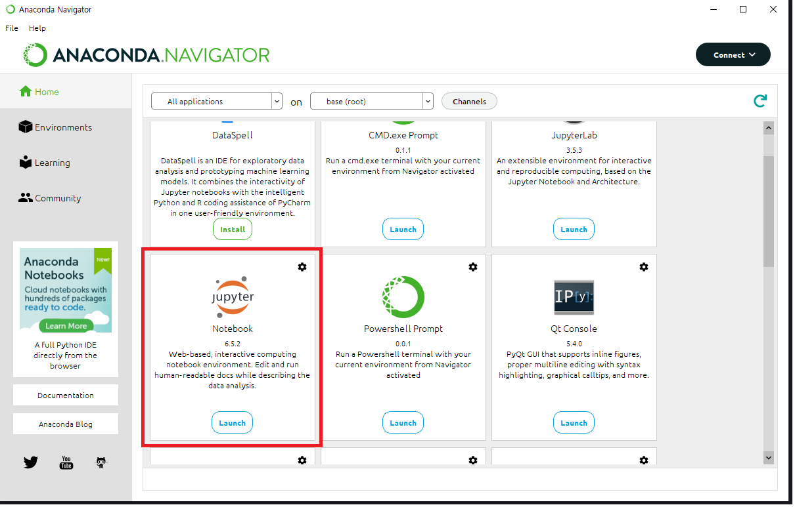

## Python install
###  - `python 3.7.2` [download](https://www.python.org/ftp/python/3.7.2/python-3.7.2-amd64.exe)<br>


<style>
  .centered-image {
    display: flex;
    justify-content: center;
    align-items: center;
    height: 400px; /* 이미지의 최대 높이 */
  }

  .centered-image img {
    max-width: 100%;
    max-height: 100%;
    object-fit: contain; /* 이미지 비율 유지 */
  }
</style>

<!-- 이미지 가운데 정렬 -->
<p align="center">
  <br><br>
  <br><br>
  <br><br>
  <br><br>
  <br><br>
  </p>
  <div class="centered-image">
    
  </div>
  
---

## ANACONDA install
### - `ANACONDA` [download](https://www.anaconda.com/download)
<p align="center">
  <br><br>
  <br><br>
  <br><br>
  <br><br>
  <br><br>
</p>

## jupyter notebook install

### - `방법 1`
<p align="center">
  <br><br>
  <br><br>
  
</p>

---

### - `방법2`

<!-- 이미지 가운데 정렬 -->
<p align="center">
  <br><br>
  
</p>
<br>

#### `C 드라이브로 이동`
<p align="center">
  
</p>

`````
cd\
`````
<br>

#### `사용할 폴더 생성`
<p align="center">
  
</p>

`````
md (사용할 폴더 이름)
`````
<br>

#### `생성된 폴더로 이동`
<p align="center">
  
</p>

`````
cd (생성된 폴더 이름)
`````
<br>

#### `jupyter notebook 설치`
<p align="center">
  
</p>

`````
pip install jupyter notebook
`````
<br>

#### `jupyter notebook 실행`
<p align="center">
  
</p>

`````
jupyter notebook
`````

- 두 가지 방법 중 아무거나 선택해서 설치.

---

___교재___

<!-- 이미지 가운데 정렬 -->
<p align="center">
  
</p>


___목차___
## Chapter 2. Python 입문
#### Data Type
<div id="DataType">
<!-- 특정 위치에 해당하는 내용 -->
</div>

- [자료형](./Chapter_2/dataType.md)
- [변수](./Chapter_2/Variable.md)
- 2-3 함수의 개념
- 2-4 패키지, 모듈, 라이브러리
- 2-5 흐름의 제어
- 2-6 자료형
- 2-7 함수의 정의
- 2-8 사용자 정의 자료형
- 2-9 키보드 입력
- 2-10 파일 입출력

## Chapter 3. 문서 다루기
- 3-1 엑셀 다루기 (OpenPyXL)
- 3-2 워드 다루기 (python-docx)
- 3-3 공공 데이터 다루기 (Pandas)

## Chapter 4. 인터넷
- 4-1 인터넷 자료에 접근하기 (beautifulsoup4)
- 4-2 네이버 검색 결과 수집하기
- 4-3 다음 뉴스 내용 수집하기

## Chapter 5. 자동화
- 5-1 주기적인 일꾼 만들기
- 5-2 네이버 웹툰 업데이트 모니터링
- 5-3 모니터링 결과를 이메일로 보내기

## Chapter 6. 기계학습
- 6-1 기계학습이란?
- 6-2 sklearn, fastai 패키지의 설치
- 6-3 Kaggle 데이터셋과 Colab 환경
- 6-4 데이터 전처리
- 6-5 랜덤포레스트 모델의 학습
- 6-6 랜덤포레스트 이해하기
- 6-7 학습 결과의 해석
